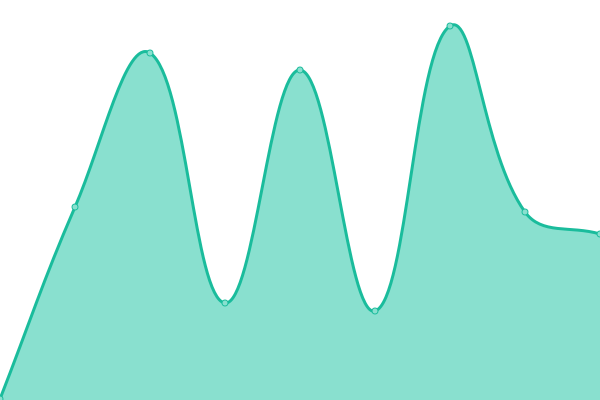
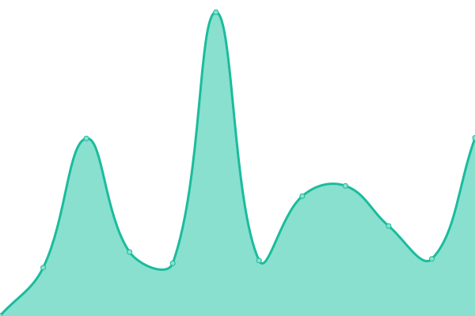
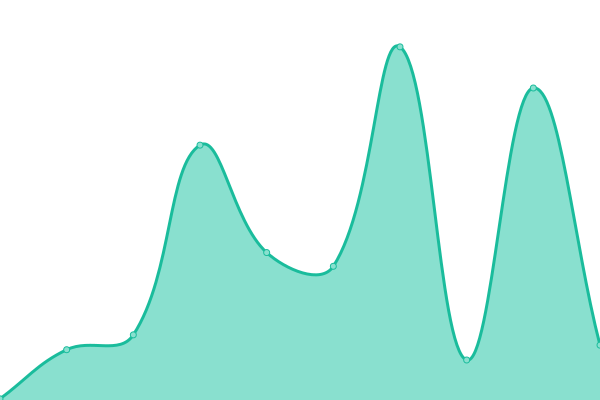
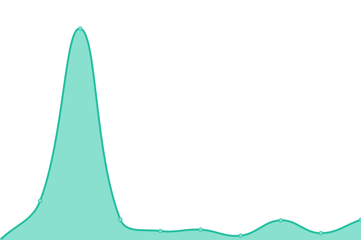
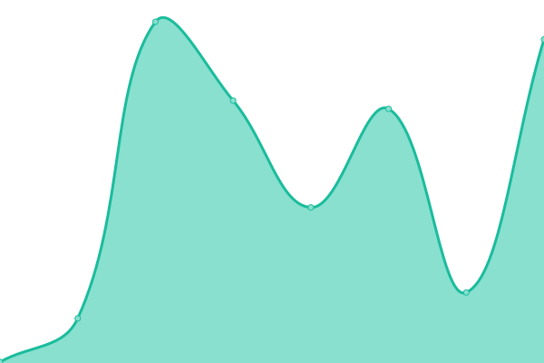
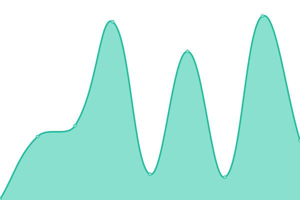
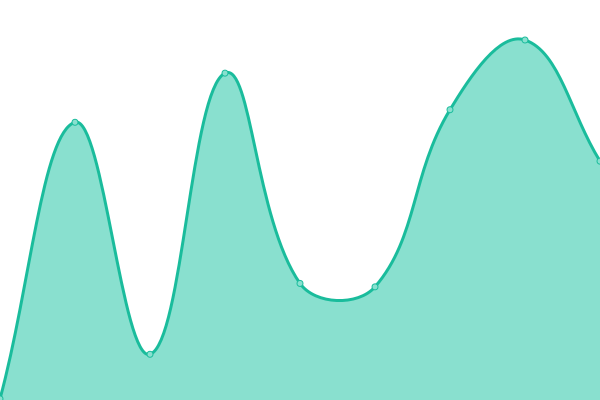
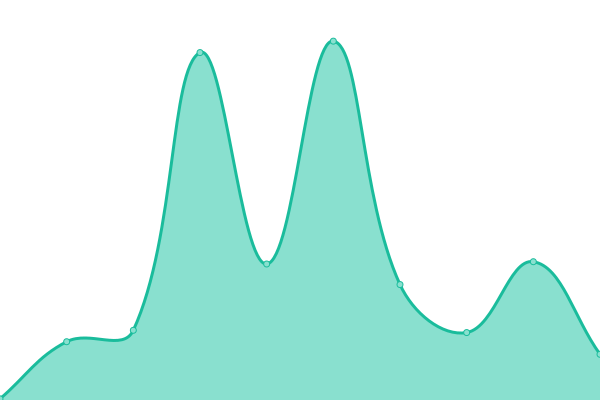

# [📈 Live Status](https://uptime.sfun.cc): <!--live status--> **🟩 All systems operational**

This repository contains the open-source uptime monitor and status page for [sfun](https://uptime.sfun.cc), powered by [Upptime](https://github.com/upptime/upptime).

With [Upptime](https://upptime.js.org), you can get your own unlimited and free uptime monitor and status page, powered entirely by a GitHub repository. We use [Issues](https://github.com/ssfun/upptime/issues) as incident reports, [Actions](https://github.com/ssfun/upptime/actions) as uptime monitors, and [Pages](https://uptime.sfun.cc) for the status page.

<!--start: status pages-->
<!-- This summary is generated by Upptime (https://github.com/upptime/upptime) -->
<!-- Do not edit this manually, your changes will be overwritten -->
<!-- prettier-ignore -->
| URL | Status | History | Response Time | Uptime |
| --- | ------ | ------- | ------------- | ------ |
|  [SFUN BLOG](https://sfun.cc) | 🟩 Up | [sfun-blog.yml](https://github.com/ssfun/upptime/commits/HEAD/history/sfun-blog.yml) | 

 336ms
     
 | 

<a href="https://uptime.sfun.cc/history/sfun-blog">100.00%</a>
    

|  [STATUS PAGE](https://status.sfun.cc) | 🟩 Up | [status-page.yml](https://github.com/ssfun/upptime/commits/HEAD/history/status-page.yml) | 

 196ms
     
 | 

<a href="https://uptime.sfun.cc/history/status-page">99.80%</a>
    

|  PLEX SYNC | 🟩 Up | [plex-sync.yml](https://github.com/ssfun/upptime/commits/HEAD/history/plex-sync.yml) | 

 205ms
     
 | 

<a href="https://uptime.sfun.cc/history/plex-sync">99.52%</a>
    

|  EMBY KEEPER | 🟩 Up | [emby-keeper.yml](https://github.com/ssfun/upptime/commits/HEAD/history/emby-keeper.yml) | 

 326ms
     
 | 

<a href="https://uptime.sfun.cc/history/emby-keeper">98.46%</a>
    

|  HF.SFUN RAYCAST | 🟩 Up | [hf-sfun-raycast.yml](https://github.com/ssfun/upptime/commits/HEAD/history/hf-sfun-raycast.yml) | 

 1546ms
     
 | 

<a href="https://uptime.sfun.cc/history/hf-sfun-raycast">57.25%</a>
    

|  HF.SMGC RAYCAST | 🟩 Up | [hf-smgc-raycast.yml](https://github.com/ssfun/upptime/commits/HEAD/history/hf-smgc-raycast.yml) | 

 242ms
     
 | 

<a href="https://uptime.sfun.cc/history/hf-smgc-raycast">57.33%</a>
    

|  WEWE RSS | 🟩 Up | [wewe-rss.yml](https://github.com/ssfun/upptime/commits/HEAD/history/wewe-rss.yml) | 

 142ms
     
 | 

<a href="https://uptime.sfun.cc/history/wewe-rss">100.00%</a>
    

|  ARKOSE SOLVER | 🟩 Up | [arkose-solver.yml](https://github.com/ssfun/upptime/commits/HEAD/history/arkose-solver.yml) | 

 589ms
     
 | 

<a href="https://uptime.sfun.cc/history/arkose-solver">98.50%</a>
    

|  ONEAPI SITE | 🟩 Up | [oneapi-site.yml](https://github.com/ssfun/upptime/commits/HEAD/history/oneapi-site.yml) | 

 522ms
     
 | 

<a href="https://uptime.sfun.cc/history/oneapi-site">98.64%</a>
    

|  HF.SFUN ONEAPI SITE | 🟩 Up | [hf-sfun-oneapi-site.yml](https://github.com/ssfun/upptime/commits/HEAD/history/hf-sfun-oneapi-site.yml) | 

 2402ms
     
 | 

<a href="https://uptime.sfun.cc/history/hf-sfun-oneapi-site">98.31%</a>
    

|  HF.SMGC ONEAPI SITE | 🟩 Up | [hf-smgc-oneapi-site.yml](https://github.com/ssfun/upptime/commits/HEAD/history/hf-smgc-oneapi-site.yml) | 

 156ms
     
 | 

<a href="https://uptime.sfun.cc/history/hf-smgc-oneapi-site">99.56%</a>
    

|  HF.SFUN HFCHAT2API | 🟩 Up | [hf-sfun-hfchat-2-api.yml](https://github.com/ssfun/upptime/commits/HEAD/history/hf-sfun-hfchat-2-api.yml) | 

 263ms
     
 | 

<a href="https://uptime.sfun.cc/history/hf-sfun-hfchat-2-api">100.00%</a>
    

|  HF.SMGC HFCHAT2API | 🟩 Up | [hf-smgc-hfchat-2-api.yml](https://github.com/ssfun/upptime/commits/HEAD/history/hf-smgc-hfchat-2-api.yml) | 

 280ms
     
 | 

<a href="https://uptime.sfun.cc/history/hf-smgc-hfchat-2-api">100.00%</a>
    

|  HF.SFUN HFLLM2API | 🟩 Up | [hf-sfun-hfllm-2-api.yml](https://github.com/ssfun/upptime/commits/HEAD/history/hf-sfun-hfllm-2-api.yml) | 

 175ms
     
 | 

<a href="https://uptime.sfun.cc/history/hf-sfun-hfllm-2-api">100.00%</a>
    

|  HF.SMGC HFLLM2API | 🟩 Up | [hf-smgc-hfllm-2-api.yml](https://github.com/ssfun/upptime/commits/HEAD/history/hf-smgc-hfllm-2-api.yml) | 

 2090ms
     
 | 

<a href="https://uptime.sfun.cc/history/hf-smgc-hfllm-2-api">100.00%</a>
    

|  HF.SFUN CHAT2API | 🟩 Up | [hf-sfun-chat-2-api.yml](https://github.com/ssfun/upptime/commits/HEAD/history/hf-sfun-chat-2-api.yml) | 

 154ms
     
 | 

<a href="https://uptime.sfun.cc/history/hf-sfun-chat-2-api">100.00%</a>
    

|  HF.SMGC CHAT2API | 🟩 Up | [hf-smgc-chat-2-api.yml](https://github.com/ssfun/upptime/commits/HEAD/history/hf-smgc-chat-2-api.yml) | 

 146ms
     
 | 

<a href="https://uptime.sfun.cc/history/hf-smgc-chat-2-api">100.00%</a>
    

|  HF.SFUN CLAUDE2API | 🟩 Up | [hf-sfun-claude-2-api.yml](https://github.com/ssfun/upptime/commits/HEAD/history/hf-sfun-claude-2-api.yml) | 

 93ms
     
 | 

<a href="https://uptime.sfun.cc/history/hf-sfun-claude-2-api">100.00%</a>
    

|  HF.SFUN DUCK2API | 🟩 Up | [hf-sfun-duck-2-api.yml](https://github.com/ssfun/upptime/commits/HEAD/history/hf-sfun-duck-2-api.yml) | 

 165ms
     
 | 

<a href="https://uptime.sfun.cc/history/hf-sfun-duck-2-api">100.00%</a>
    

|  HF.SMGC DUCK2API | 🟩 Up | [hf-smgc-duck-2-api.yml](https://github.com/ssfun/upptime/commits/HEAD/history/hf-smgc-duck-2-api.yml) | 

 144ms
     
 | 

<a href="https://uptime.sfun.cc/history/hf-smgc-duck-2-api">100.00%</a>
    

|  RENDER DUCK2API | 🟩 Up | [render-duck-2-api.yml](https://github.com/ssfun/upptime/commits/HEAD/history/render-duck-2-api.yml) | 

 199ms
     
 | 

<a href="https://uptime.sfun.cc/history/render-duck-2-api">98.49%</a>
    

|  KOYEB DUCK2API | 🟩 Up | [koyeb-duck-2-api.yml](https://github.com/ssfun/upptime/commits/HEAD/history/koyeb-duck-2-api.yml) | 

 212ms
     
 | 

<a href="https://uptime.sfun.cc/history/koyeb-duck-2-api">100.00%</a>
    

|  HF.SFUN DEEPSEEK2API | 🟩 Up | [hf-sfun-deepseek-2-api.yml](https://github.com/ssfun/upptime/commits/HEAD/history/hf-sfun-deepseek-2-api.yml) | 

 145ms
     
 | 

<a href="https://uptime.sfun.cc/history/hf-sfun-deepseek-2-api">100.00%</a>
    

|  HF.SMGC DEEPSEEK2API | 🟩 Up | [hf-smgc-deepseek-2-api.yml](https://github.com/ssfun/upptime/commits/HEAD/history/hf-smgc-deepseek-2-api.yml) | 

 175ms
     
 | 

<a href="https://uptime.sfun.cc/history/hf-smgc-deepseek-2-api">64.15%</a>
    

<!--end: status pages-->

[**Visit our status website →**](https://uptime.sfun.cc)

## 📄 License

- Powered by: [Upptime](https://github.com/upptime/upptime)
- Code: [MIT](./LICENSE) © [Anand Chowdhary](https://anandchowdhary.com), supported by [Pabio](https://pabio.com)
- Data in the `./history` directory: [Open Database License](https://opendatacommons.org/licenses/odbl/1-0/)
