# [📈 Live Status](https://uptime.sfun.cc): <!--live status--> **🟧 Partial outage**

This repository contains the open-source uptime monitor and status page for [sfun](https://uptime.sfun.cc), powered by [Upptime](https://github.com/upptime/upptime).

With [Upptime](https://upptime.js.org), you can get your own unlimited and free uptime monitor and status page, powered entirely by a GitHub repository. We use [Issues](https://github.com/ssfun/upptime/issues) as incident reports, [Actions](https://github.com/ssfun/upptime/actions) as uptime monitors, and [Pages](https://uptime.sfun.cc) for the status page.

<!--start: status pages-->
<!-- This summary is generated by Upptime (https://github.com/upptime/upptime) -->
<!-- Do not edit this manually, your changes will be overwritten -->
<!-- prettier-ignore -->
| URL | Status | History | Response Time | Uptime |
| --- | ------ | ------- | ------------- | ------ |
|  [SFUN BLOG](https://sfun.cc) | 🟩 Up | [sfun-blog.yml](https://github.com/ssfun/upptime/commits/HEAD/history/sfun-blog.yml) | 

 138ms
     
 | 

<a href="https://uptime.sfun.cc/history/sfun-blog">100.00%</a>
    

|  [STATUS PAGE](https://status.sfun.cc) | 🟩 Up | [status-page.yml](https://github.com/ssfun/upptime/commits/HEAD/history/status-page.yml) | 

 269ms
     
 | 

<a href="https://uptime.sfun.cc/history/status-page">100.00%</a>
    

|  PLEX SYNC | 🟩 Up | [plex-sync.yml](https://github.com/ssfun/upptime/commits/HEAD/history/plex-sync.yml) | 

 191ms
     
 | 

<a href="https://uptime.sfun.cc/history/plex-sync">100.00%</a>
    

|  Raycast Backend | 🟩 Up | [raycast-backend.yml](https://github.com/ssfun/upptime/commits/HEAD/history/raycast-backend.yml) | 

 393ms
     
 | 

<a href="https://uptime.sfun.cc/history/raycast-backend">100.00%</a>
    

|  ONE API SITE 01 | 🟩 Up | [one-api-site-01.yml](https://github.com/ssfun/upptime/commits/HEAD/history/one-api-site-01.yml) | 

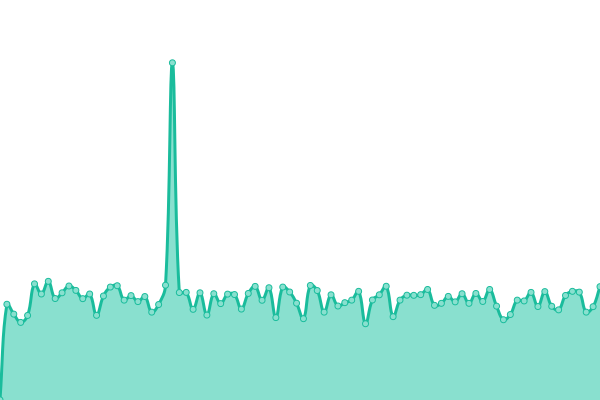 833ms
     
 | 

<a href="https://uptime.sfun.cc/history/one-api-site-01">48.20%</a>
    

|  ONE API SITE 02 | 🟩 Up | [one-api-site-02.yml](https://github.com/ssfun/upptime/commits/HEAD/history/one-api-site-02.yml) | 

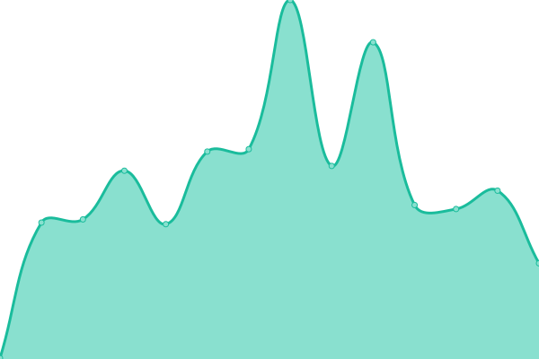 217ms
     
 | 

<a href="https://uptime.sfun.cc/history/one-api-site-02">54.34%</a>
    

|  HuggingChat API 01 | 🟩 Up | [hugging-chat-api-01.yml](https://github.com/ssfun/upptime/commits/HEAD/history/hugging-chat-api-01.yml) | 

 3314ms
     
 | 

<a href="https://uptime.sfun.cc/history/hugging-chat-api-01">96.77%</a>
    

|  HuggingChat API 02 | 🟩 Up | [hugging-chat-api-02.yml](https://github.com/ssfun/upptime/commits/HEAD/history/hugging-chat-api-02.yml) | 

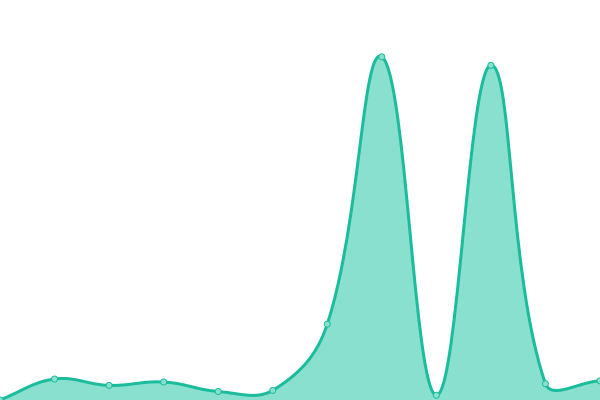 1858ms
     
 | 

<a href="https://uptime.sfun.cc/history/hugging-chat-api-02">98.58%</a>
    

|  HuggingFace API 01 | 🟩 Up | [hugging-face-api-01.yml](https://github.com/ssfun/upptime/commits/HEAD/history/hugging-face-api-01.yml) | 

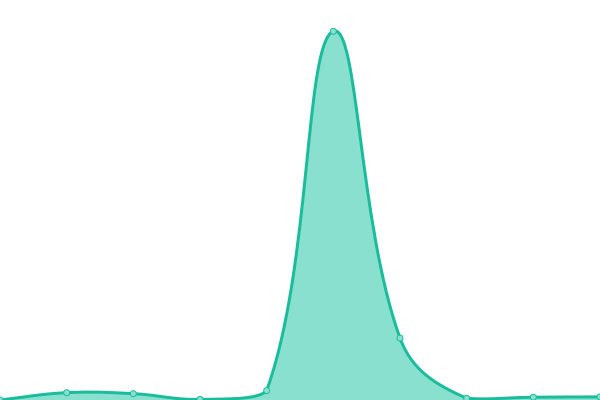 3786ms
     
 | 

<a href="https://uptime.sfun.cc/history/hugging-face-api-01">98.61%</a>
    

|  HuggingFace API 02 | 🟩 Up | [hugging-face-api-02.yml](https://github.com/ssfun/upptime/commits/HEAD/history/hugging-face-api-02.yml) | 

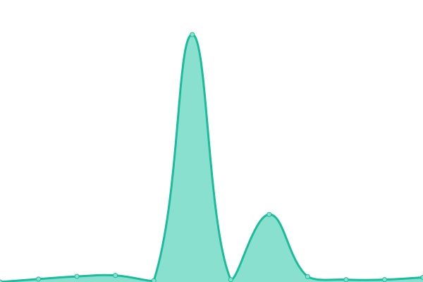 2517ms
     
 | 

<a href="https://uptime.sfun.cc/history/hugging-face-api-02">98.65%</a>
    

|  GPTCHAT2API HF 01 | 🟩 Up | [gptchat-2-api-hf-01.yml](https://github.com/ssfun/upptime/commits/HEAD/history/gptchat-2-api-hf-01.yml) | 

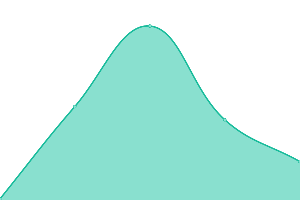 700ms
     
 | 

<a href="https://uptime.sfun.cc/history/gptchat-2-api-hf-01">35.98%</a>
    

|  GPTCHAT2API HF 02 | 🟩 Up | [gptchat-2-api-hf-02.yml](https://github.com/ssfun/upptime/commits/HEAD/history/gptchat-2-api-hf-02.yml) | 

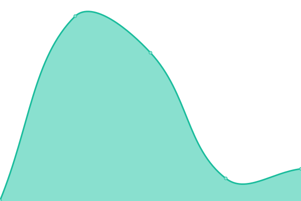 1869ms
     
 | 

<a href="https://uptime.sfun.cc/history/gptchat-2-api-hf-02">36.03%</a>
    

|  GPTDUCK2API HF 01 | 🟩 Up | [gptduck-2-api-hf-01.yml](https://github.com/ssfun/upptime/commits/HEAD/history/gptduck-2-api-hf-01.yml) | 

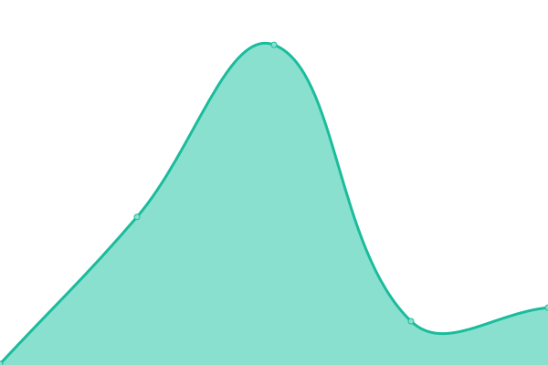 2486ms
     
 | 

<a href="https://uptime.sfun.cc/history/gptduck-2-api-hf-01">100.00%</a>
    

|  GPTDUCK2API HF 02 | 🟩 Up | [gptduck-2-api-hf-02.yml](https://github.com/ssfun/upptime/commits/HEAD/history/gptduck-2-api-hf-02.yml) | 

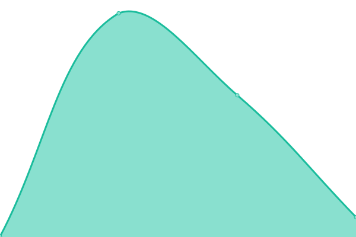 2308ms
     
 | 

<a href="https://uptime.sfun.cc/history/gptduck-2-api-hf-02">100.00%</a>
    

|  GPT-3.5 API 01 | 🟩 Up | [gpt-3-5-api-01.yml](https://github.com/ssfun/upptime/commits/HEAD/history/gpt-3-5-api-01.yml) | 

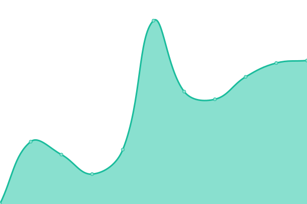 405ms
     
 | 

<a href="https://uptime.sfun.cc/history/gpt-3-5-api-01">100.00%</a>
    

|  GPT-3.5 API 02 | 🟥 Down | [gpt-3-5-api-02.yml](https://github.com/ssfun/upptime/commits/HEAD/history/gpt-3-5-api-02.yml) | 

 819ms
     
 | 

<a href="https://uptime.sfun.cc/history/gpt-3-5-api-02">70.77%</a>
    

|  SG CDN 01 | 🟩 Up | [sg-cdn-01.yml](https://github.com/ssfun/upptime/commits/HEAD/history/sg-cdn-01.yml) | 

 202ms
     
 | 

<a href="https://uptime.sfun.cc/history/sg-cdn-01">100.00%</a>
    

|  SG CDN 02 | 🟩 Up | [sg-cdn-02.yml](https://github.com/ssfun/upptime/commits/HEAD/history/sg-cdn-02.yml) | 

 202ms
     
 | 

<a href="https://uptime.sfun.cc/history/sg-cdn-02">100.00%</a>
    

|  JP CDN 01 | 🟩 Up | [jp-cdn-01.yml](https://github.com/ssfun/upptime/commits/HEAD/history/jp-cdn-01.yml) | 

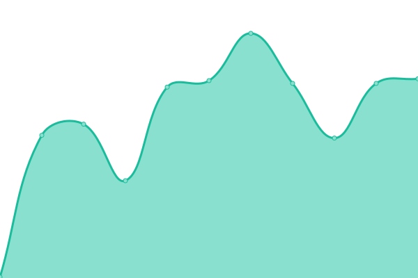 190ms
     
 | 

<a href="https://uptime.sfun.cc/history/jp-cdn-01">100.00%</a>
    

|  KR CDN 01 | 🟩 Up | [kr-cdn-01.yml](https://github.com/ssfun/upptime/commits/HEAD/history/kr-cdn-01.yml) | 

 165ms
     
 | 

<a href="https://uptime.sfun.cc/history/kr-cdn-01">100.00%</a>
    

|  US CDN 01 | 🟩 Up | [us-cdn-01.yml](https://github.com/ssfun/upptime/commits/HEAD/history/us-cdn-01.yml) | 

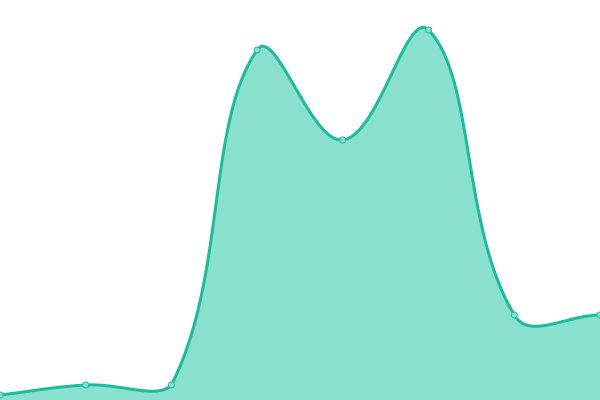 44ms
     
 | 

<a href="https://uptime.sfun.cc/history/us-cdn-01">100.00%</a>
    

|  US CDN 02 | 🟥 Down | [us-cdn-02.yml](https://github.com/ssfun/upptime/commits/HEAD/history/us-cdn-02.yml) | 

 0ms
     
 | 

<a href="https://uptime.sfun.cc/history/us-cdn-02">0.00%</a>
    

|  AE CDN 01 | 🟩 Up | [ae-cdn-01.yml](https://github.com/ssfun/upptime/commits/HEAD/history/ae-cdn-01.yml) | 

 211ms
     
 | 

<a href="https://uptime.sfun.cc/history/ae-cdn-01">100.00%</a>
    

|  HK CDN 01 | 🟩 Up | [hk-cdn-01.yml](https://github.com/ssfun/upptime/commits/HEAD/history/hk-cdn-01.yml) | 

 184ms
     
 | 

<a href="https://uptime.sfun.cc/history/hk-cdn-01">100.00%</a>
    

|  HK CDN 02 | 🟩 Up | [hk-cdn-02.yml](https://github.com/ssfun/upptime/commits/HEAD/history/hk-cdn-02.yml) | 

 183ms
     
 | 

<a href="https://uptime.sfun.cc/history/hk-cdn-02">100.00%</a>
    

<!--end: status pages-->

[**Visit our status website →**](https://uptime.sfun.cc)

## 📄 License

- Powered by: [Upptime](https://github.com/upptime/upptime)
- Code: [MIT](./LICENSE) © [Anand Chowdhary](https://anandchowdhary.com), supported by [Pabio](https://pabio.com)
- Data in the `./history` directory: [Open Database License](https://opendatacommons.org/licenses/odbl/1-0/)
