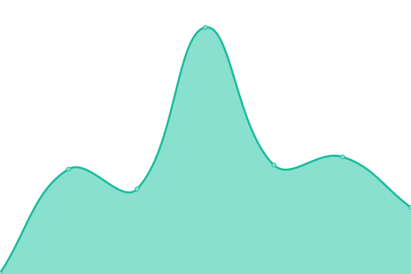

# [📈 Live Status](https://uptime.sfun.cc): <!--live status--> **🟧 Partial outage**

This repository contains the open-source uptime monitor and status page for [sfun](https://uptime.sfun.cc), powered by [Upptime](https://github.com/upptime/upptime).

With [Upptime](https://upptime.js.org), you can get your own unlimited and free uptime monitor and status page, powered entirely by a GitHub repository. We use [Issues](https://github.com/ssfun/upptime/issues) as incident reports, [Actions](https://github.com/ssfun/upptime/actions) as uptime monitors, and [Pages](https://uptime.sfun.cc) for the status page.

<!--start: status pages-->
<!-- This summary is generated by Upptime (https://github.com/upptime/upptime) -->
<!-- Do not edit this manually, your changes will be overwritten -->
<!-- prettier-ignore -->
| URL | Status | History | Response Time | Uptime |
| --- | ------ | ------- | ------------- | ------ |
|  SFUN BLOG | 🟩 Up | [sfun-blog.yml](https://github.com/ssfun/upptime/commits/HEAD/history/sfun-blog.yml) | 

 1241ms
     
 | 

<a href="https://uptime.sfun.cc/history/sfun-blog">99.78%</a>
    

|  STATUS PAGE | 🟩 Up | [status-page.yml](https://github.com/ssfun/upptime/commits/HEAD/history/status-page.yml) | 

 256ms
     
 | 

<a href="https://uptime.sfun.cc/history/status-page">100.00%</a>
    

|  API SITE | 🟩 Up | [api-site.yml](https://github.com/ssfun/upptime/commits/HEAD/history/api-site.yml) | 

 210ms
     
 | 

<a href="https://uptime.sfun.cc/history/api-site">100.00%</a>
    

|  GLANCE PAGE | 🟩 Up | [glance-page.yml](https://github.com/ssfun/upptime/commits/HEAD/history/glance-page.yml) | 

 1193ms
     
 | 

<a href="https://uptime.sfun.cc/history/glance-page">99.79%</a>
    

|  ALIST | 🟩 Up | [alist.yml](https://github.com/ssfun/upptime/commits/HEAD/history/alist.yml) | 

 416ms
     
 | 

<a href="https://uptime.sfun.cc/history/alist">100.00%</a>
    

|  ONE HUB | 🟩 Up | [one-hub.yml](https://github.com/ssfun/upptime/commits/HEAD/history/one-hub.yml) | 

 258ms
     
 | 

<a href="https://uptime.sfun.cc/history/one-hub">98.98%</a>
    

|  ONE API | 🟩 Up | [one-api.yml](https://github.com/ssfun/upptime/commits/HEAD/history/one-api.yml) | 

 196ms
     
 | 

<a href="https://uptime.sfun.cc/history/one-api">96.37%</a>
    

|  NEW API | 🟩 Up | [new-api.yml](https://github.com/ssfun/upptime/commits/HEAD/history/new-api.yml) | 

 2214ms
     
 | 

<a href="https://uptime.sfun.cc/history/new-api">95.52%</a>
    

|  LOBECHAT | 🟩 Up | [lobechat.yml](https://github.com/ssfun/upptime/commits/HEAD/history/lobechat.yml) | 

 409ms
     
 | 

<a href="https://uptime.sfun.cc/history/lobechat">100.00%</a>
    

|  OPEN WEBUI | 🟩 Up | [open-webui.yml](https://github.com/ssfun/upptime/commits/HEAD/history/open-webui.yml) | 

 469ms
     
 | 

<a href="https://uptime.sfun.cc/history/open-webui">100.00%</a>
    

|  SERV00 | 🟩 Up | [serv-00.yml](https://github.com/ssfun/upptime/commits/HEAD/history/serv-00.yml) | 

 706ms
     
 | 

<a href="https://uptime.sfun.cc/history/serv-00">99.76%</a>
    

|  EMBY KEEPER | 🟩 Up | [emby-keeper.yml](https://github.com/ssfun/upptime/commits/HEAD/history/emby-keeper.yml) | 

 236ms
     
 | 

<a href="https://uptime.sfun.cc/history/emby-keeper">100.00%</a>
    

|  PLEX SYNC | 🟩 Up | [plex-sync.yml](https://github.com/ssfun/upptime/commits/HEAD/history/plex-sync.yml) | 

 198ms
     
 | 

<a href="https://uptime.sfun.cc/history/plex-sync">99.14%</a>
    

|  WEWE RSS | 🟩 Up | [wewe-rss.yml](https://github.com/ssfun/upptime/commits/HEAD/history/wewe-rss.yml) | 

 197ms
     
 | 

<a href="https://uptime.sfun.cc/history/wewe-rss">100.00%</a>
    

|  ARKOSE SOLVER | 🟩 Up | [arkose-solver.yml](https://github.com/ssfun/upptime/commits/HEAD/history/arkose-solver.yml) | 

 512ms
     
 | 

<a href="https://uptime.sfun.cc/history/arkose-solver">99.84%</a>
    

|  HF.SFUN RAYCAST | 🟩 Up | [hf-sfun-raycast.yml](https://github.com/ssfun/upptime/commits/HEAD/history/hf-sfun-raycast.yml) | 

 252ms
     
 | 

<a href="https://uptime.sfun.cc/history/hf-sfun-raycast">91.29%</a>
    

|  HF.SMGC RAYCAST | 🟥 Down | [hf-smgc-raycast.yml](https://github.com/ssfun/upptime/commits/HEAD/history/hf-smgc-raycast.yml) | 

 214ms
     
 | 

<a href="https://uptime.sfun.cc/history/hf-smgc-raycast">99.49%</a>
    

|  HF.SFUN CHAT2API | 🟩 Up | [hf-sfun-chat-2-api.yml](https://github.com/ssfun/upptime/commits/HEAD/history/hf-sfun-chat-2-api.yml) | 

 163ms
     
 | 

<a href="https://uptime.sfun.cc/history/hf-sfun-chat-2-api">99.68%</a>
    

|  HF.SMGC CHAT2API | 🟥 Down | [hf-smgc-chat-2-api.yml](https://github.com/ssfun/upptime/commits/HEAD/history/hf-smgc-chat-2-api.yml) | 

 188ms
     
 | 

<a href="https://uptime.sfun.cc/history/hf-smgc-chat-2-api">99.35%</a>
    

|  HF.SFUN DUCK2API | 🟥 Down | [hf-sfun-duck-2-api.yml](https://github.com/ssfun/upptime/commits/HEAD/history/hf-sfun-duck-2-api.yml) | 

 214ms
     
 | 

<a href="https://uptime.sfun.cc/history/hf-sfun-duck-2-api">99.44%</a>
    

|  HF.SMGC DUCK2API | 🟥 Down | [hf-smgc-duck-2-api.yml](https://github.com/ssfun/upptime/commits/HEAD/history/hf-smgc-duck-2-api.yml) | 

 171ms
     
 | 

<a href="https://uptime.sfun.cc/history/hf-smgc-duck-2-api">99.34%</a>
    

|  HF.SFUN HFCHAT2API | 🟥 Down | [hf-sfun-hfchat-2-api.yml](https://github.com/ssfun/upptime/commits/HEAD/history/hf-sfun-hfchat-2-api.yml) | 

 260ms
     
 | 

<a href="https://uptime.sfun.cc/history/hf-sfun-hfchat-2-api">99.38%</a>
    

|  HF.SMGC HFCHAT2API | 🟩 Up | [hf-smgc-hfchat-2-api.yml](https://github.com/ssfun/upptime/commits/HEAD/history/hf-smgc-hfchat-2-api.yml) | 

 269ms
     
 | 

<a href="https://uptime.sfun.cc/history/hf-smgc-hfchat-2-api">99.17%</a>
    

|  HF.SFUN CLAUDE2API | 🟥 Down | [hf-sfun-claude-2-api.yml](https://github.com/ssfun/upptime/commits/HEAD/history/hf-sfun-claude-2-api.yml) | 

 159ms
     
 | 

<a href="https://uptime.sfun.cc/history/hf-sfun-claude-2-api">99.19%</a>
    

|  RENDER DUCK2API | 🟩 Up | [render-duck-2-api.yml](https://github.com/ssfun/upptime/commits/HEAD/history/render-duck-2-api.yml) | 

 170ms
     
 | 

<a href="https://uptime.sfun.cc/history/render-duck-2-api">99.50%</a>
    

|  KOYEB DUCK2API | 🟩 Up | [koyeb-duck-2-api.yml](https://github.com/ssfun/upptime/commits/HEAD/history/koyeb-duck-2-api.yml) | 

 261ms
     
 | 

<a href="https://uptime.sfun.cc/history/koyeb-duck-2-api">100.00%</a>
    

<!--end: status pages-->

[**Visit our status website →**](https://uptime.sfun.cc)

## 📄 License

- Powered by: [Upptime](https://github.com/upptime/upptime)
- Code: [MIT](./LICENSE) © [Anand Chowdhary](https://anandchowdhary.com), supported by [Pabio](https://pabio.com)
- Data in the `./history` directory: [Open Database License](https://opendatacommons.org/licenses/odbl/1-0/)
