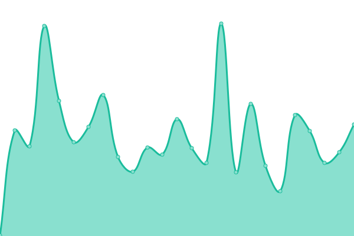

# [📈 Live Status](https://uptime.sfun.cc): <!--live status--> **🟨 Degraded performance**

This repository contains the open-source uptime monitor and status page for [sfun](https://uptime.sfun.cc), powered by [Upptime](https://github.com/upptime/upptime).

With [Upptime](https://upptime.js.org), you can get your own unlimited and free uptime monitor and status page, powered entirely by a GitHub repository. We use [Issues](https://github.com/ssfun/upptime/issues) as incident reports, [Actions](https://github.com/ssfun/upptime/actions) as uptime monitors, and [Pages](https://uptime.sfun.cc) for the status page.

<!--start: status pages-->
<!-- This summary is generated by Upptime (https://github.com/upptime/upptime) -->
<!-- Do not edit this manually, your changes will be overwritten -->
<!-- prettier-ignore -->
| URL | Status | History | Response Time | Uptime |
| --- | ------ | ------- | ------------- | ------ |
|  SFUN BLOG | 🟨 Degraded | [sfun-blog.yml](https://github.com/ssfun/upptime/commits/HEAD/history/sfun-blog.yml) | 

 2233ms
     
 | 

<a href="https://uptime.sfun.cc/history/sfun-blog">99.51%</a>
    

|  STATUS PAGE | 🟩 Up | [status-page.yml](https://github.com/ssfun/upptime/commits/HEAD/history/status-page.yml) | 

 256ms
     
 | 

<a href="https://uptime.sfun.cc/history/status-page">100.00%</a>
    

|  API SITE | 🟨 Degraded | [api-site.yml](https://github.com/ssfun/upptime/commits/HEAD/history/api-site.yml) | 

 2178ms
     
 | 

<a href="https://uptime.sfun.cc/history/api-site">99.51%</a>
    

|  GLANCE PAGE | 🟨 Degraded | [glance-page.yml](https://github.com/ssfun/upptime/commits/HEAD/history/glance-page.yml) | 

 2208ms
     
 | 

<a href="https://uptime.sfun.cc/history/glance-page">99.52%</a>
    

|  ALIST | 🟨 Degraded | [alist.yml](https://github.com/ssfun/upptime/commits/HEAD/history/alist.yml) | 

 1865ms
     
 | 

<a href="https://uptime.sfun.cc/history/alist">99.52%</a>
    

|  ONE HUB | 🟨 Degraded | [one-hub.yml](https://github.com/ssfun/upptime/commits/HEAD/history/one-hub.yml) | 

 2167ms
     
 | 

<a href="https://uptime.sfun.cc/history/one-hub">99.53%</a>
    

|  ONE API | 🟨 Degraded | [one-api.yml](https://github.com/ssfun/upptime/commits/HEAD/history/one-api.yml) | 

 3024ms
     
 | 

<a href="https://uptime.sfun.cc/history/one-api">99.53%</a>
    

|  NEW API | 🟨 Degraded | [new-api.yml](https://github.com/ssfun/upptime/commits/HEAD/history/new-api.yml) | 

 2176ms
     
 | 

<a href="https://uptime.sfun.cc/history/new-api">99.54%</a>
    

|  LOBECHAT | 🟨 Degraded | [lobechat.yml](https://github.com/ssfun/upptime/commits/HEAD/history/lobechat.yml) | 

 2337ms
     
 | 

<a href="https://uptime.sfun.cc/history/lobechat">99.54%</a>
    

|  OPEN WEBUI | 🟨 Degraded | [open-webui.yml](https://github.com/ssfun/upptime/commits/HEAD/history/open-webui.yml) | 

 2196ms
     
 | 

<a href="https://uptime.sfun.cc/history/open-webui">99.55%</a>
    

|  SERV00 | 🟩 Up | [serv-00.yml](https://github.com/ssfun/upptime/commits/HEAD/history/serv-00.yml) | 

 810ms
     
 | 

<a href="https://uptime.sfun.cc/history/serv-00">100.00%</a>
    

|  EMBY KEEPER | 🟨 Degraded | [emby-keeper.yml](https://github.com/ssfun/upptime/commits/HEAD/history/emby-keeper.yml) | 

 2185ms
     
 | 

<a href="https://uptime.sfun.cc/history/emby-keeper">99.55%</a>
    

|  PLEX SYNC | 🟩 Up | [plex-sync.yml](https://github.com/ssfun/upptime/commits/HEAD/history/plex-sync.yml) | 

 481ms
     
 | 

<a href="https://uptime.sfun.cc/history/plex-sync">97.24%</a>
    

|  WEWE RSS | 🟨 Degraded | [wewe-rss.yml](https://github.com/ssfun/upptime/commits/HEAD/history/wewe-rss.yml) | 

 2203ms
     
 | 

<a href="https://uptime.sfun.cc/history/wewe-rss">99.56%</a>
    

|  ARKOSE SOLVER | 🟩 Up | [arkose-solver.yml](https://github.com/ssfun/upptime/commits/HEAD/history/arkose-solver.yml) | 

 608ms
     
 | 

<a href="https://uptime.sfun.cc/history/arkose-solver">97.71%</a>
    

|  HF.SFUN RAYCAST | 🟨 Degraded | [hf-sfun-raycast.yml](https://github.com/ssfun/upptime/commits/HEAD/history/hf-sfun-raycast.yml) | 

 354ms
     
 | 

<a href="https://uptime.sfun.cc/history/hf-sfun-raycast">67.76%</a>
    

|  RENDER ONEHUB | 🟩 Up | [render-onehub.yml](https://github.com/ssfun/upptime/commits/HEAD/history/render-onehub.yml) | 

 143ms
     
 | 

<a href="https://uptime.sfun.cc/history/render-onehub">99.43%</a>
    

|  RENDER DUCK2API | 🟩 Up | [render-duck-2-api.yml](https://github.com/ssfun/upptime/commits/HEAD/history/render-duck-2-api.yml) | 

 188ms
     
 | 

<a href="https://uptime.sfun.cc/history/render-duck-2-api">98.66%</a>
    

|  KOYEB DUCK2API | 🟩 Up | [koyeb-duck-2-api.yml](https://github.com/ssfun/upptime/commits/HEAD/history/koyeb-duck-2-api.yml) | 

 345ms
     
 | 

<a href="https://uptime.sfun.cc/history/koyeb-duck-2-api">100.00%</a>
    

<!--end: status pages-->

[**Visit our status website →**](https://uptime.sfun.cc)

## 📄 License

- Powered by: [Upptime](https://github.com/upptime/upptime)
- Code: [MIT](./LICENSE) © [Anand Chowdhary](https://anandchowdhary.com), supported by [Pabio](https://pabio.com)
- Data in the `./history` directory: [Open Database License](https://opendatacommons.org/licenses/odbl/1-0/)
